# Conjur UI React 

A lightweight React-based administration interface for Conjur OSS. It provides a modern web UI for managing resources, secrets, policies, groups, and authenticators while complementing the existing CLI and REST API.

The goal is to provide a simple developer-friendly interface for learning, testing, and working with Conjur OSS.

## Highlights

- 🔐 OIDC and password authentication support
- 🚀 Server-side pagination and search for large Conjur environments
- 📝 Interactive YAML policy editor with validation and dry-run support
- 🔑 Dynamic authenticator creation using Conjur APIs
- ⚛️ Modern React-based UI built on Conjur REST APIs

## Table of Contents

- [About](#about)
- [Non-Goals](#non-goals)
- [Features](#features)
- [Development Environment](#development-environment)
- [Screenshots](#screenshots)
  - [Resources](#resources-1)
  - [Secrets](#secrets-1)
  - [Groups](#groups-1)
  - [Authenticators](#authenticators-1)
  - [Policy Management](#policy-management-1)

## About

Conjur React UI is a modern, lightweight web administration interface for Conjur OSS.

The project provides a graphical interface for managing common Conjur workflows, including resources, secrets, policies, groups, and authenticators, while complementing the existing CLI and REST API.

Having spent several years working on Conjur, I wanted to build a simple and extensible UI that makes Conjur OSS easier to explore, configure, and manage. The goal is to provide a developer-friendly interface that can scale from local development environments to larger Conjur deployments.

The project is designed around Conjur's existing APIs and supports modern authentication workflows, including OIDC, while keeping the UI lightweight and easy to extend.

## Non-Goals

This project is intended as a **developer learning tool and local sandbox utility** for Conjur OSS. Its goal is to simplify exploring and working with Conjur during development, not to replace or compete with enterprise management solutions.

To maintain that focus, the following features are **explicitly out of scope**:

- **Production security features**, such as advanced cluster health monitoring, enterprise-grade auditing, and operational dashboards.
- **Enterprise-only capabilities**, including features such as Dynamic Secrets, advanced replication synchronization, and other Conjur Enterprise functionality.

For production deployments, high-availability configurations, compliance reporting, and enterprise secret lifecycle management, please refer to the official CyberArk Conjur Enterprise documentation.

## Features

### Authentication
- ✅ Password authentication
- ✅ OIDC authentication

### Resources
- ✅ View resources
- ✅ View resource details
- ✅ View resource annotations
- ✅ View resource permissions
- ⬜ Role Graph

### Secrets
- ✅ Browse secrets
- ✅ View secret details
- ✅ Add/Update Secret 
- ⬜ Secret history

### Groups
- ✅ Browse groups
- ✅ View group details
- ✅ Add/Remove members from group

### Authenticators
- ✅ Browse authenticators
- ✅ View authenticator details
- ✅ Enable Authenticators
- ✅ Create Authenticators with V2 API
- ✅ dynamic forms for authentictors 
- ⬜ Authenticator validation/testing

### Policy Management
- ✅ YAML policy editor
- ✅ YAML policy validations through editor
- ✅ View Effective policy
- ✅ View policy history
- ✅ Load policies
- ✅ Policy dry-run validation
- ✅ View created, deleted, and updated resources during dry-run

### Scaling and Visualization
- ✅ Server-side resource search
- ✅ Server-side pagination
- ✅ Resource filtering
- ⬜ Advanced resource visualization
- ⬜ Role Graph visualization

## Development Environment

Conjur React UI is designed to run alongside the Conjur OSS development environment.

The React application does not create or manage its own Conjur instance. Instead, it connects to an existing Conjur development stack and communicates with Conjur through the Vite development proxy.

For detailed setup instructions, Docker configuration, networking requirements, and connecting to other Conjur environments, see:

[Conjur React Development Environment](./dev/README.md)

The Conjur backend should be started using the official Conjur development instructions:

https://github.com/cyberark/conjur/blob/master/CONTRIBUTING.md

### Start the UI container from repo root

You can start the UI container and provide a deployment-specific Conjur account and API URI:

```bash
./start.sh --account cucumber --conjur-uri http://conjur:3000
```

For local OIDC/Keycloak profile startup, use the development workflow in [dev/README.md](dev/README.md).

## Screenshots

### Authentication
#### Loginto the ui with a apikey or with oidc authentication if configured
View an overview of the Conjur environment and common administration workflows.


---


### Dashboard

#### Dashboard Overview
View an overview of the Conjur environment and common administration workflows.

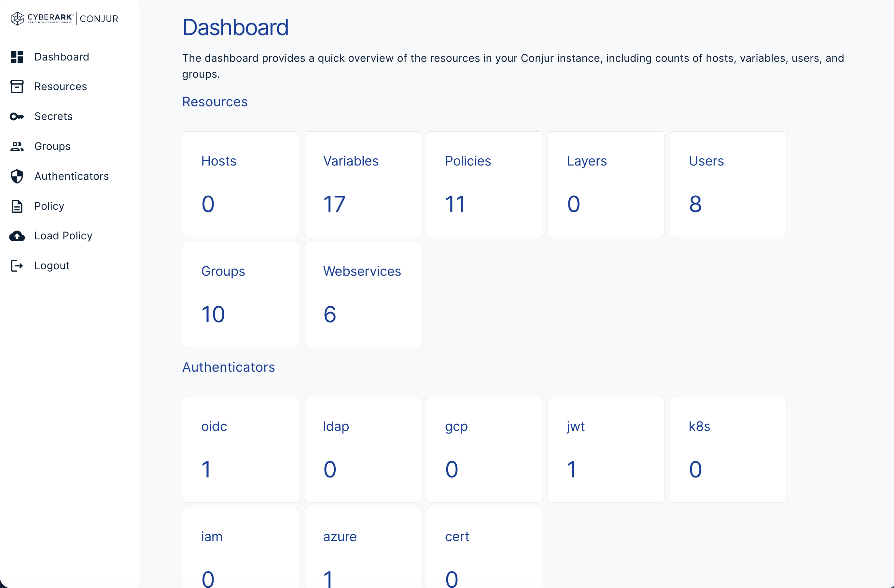

---

### Resources

#### Resources List
Browse all Conjur resources with filtering and quick access to resource details.
This includes server side filtering, searching and pagination

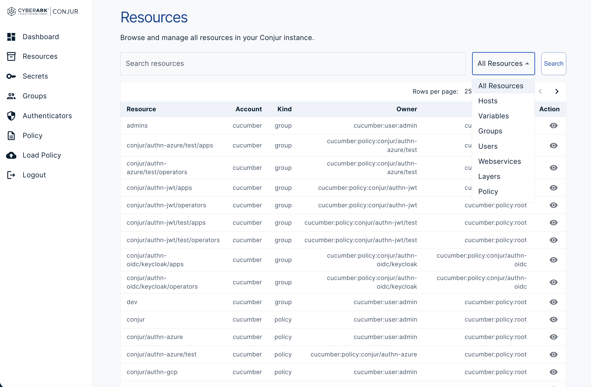

#### Resource Details
View resource metadata, annotations, permissions, and ownership. Different sections will be displayed based on resource type, like group, secret and policy.

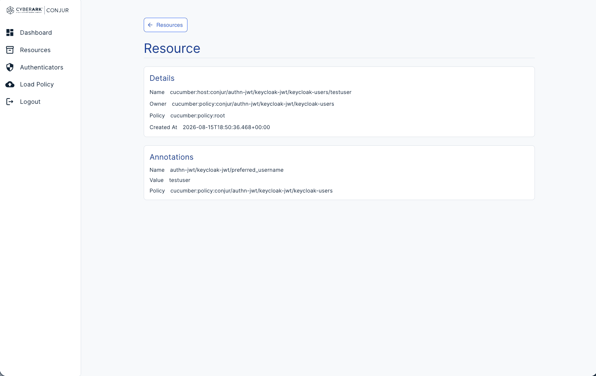

---

### Secrets

#### Secret Details
Inspect an individual secret and view its metadata.

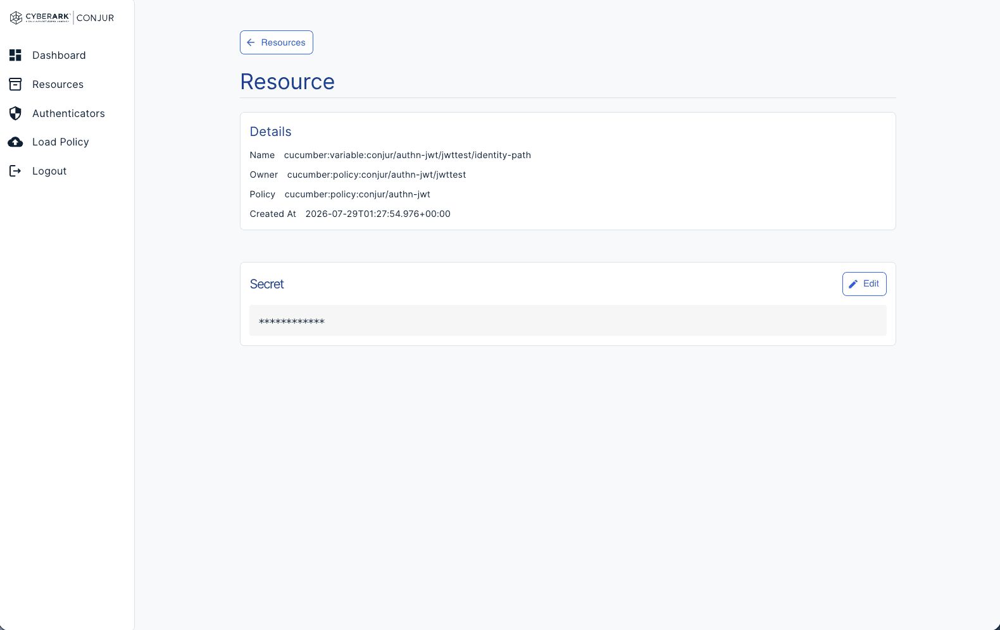

#### Edit Secret
Update an existing secret directly from the UI.

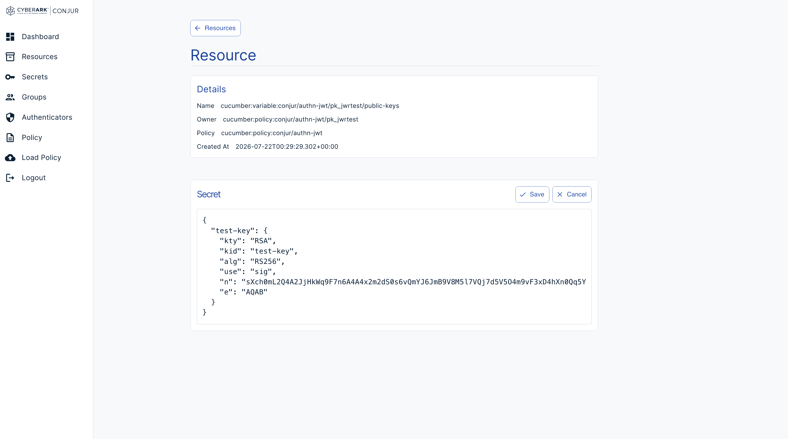

---

### Groups

#### Group Management
View and manage group membership within Conjur.

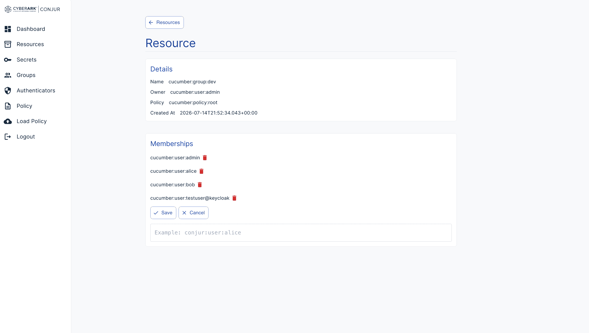

---

### Authenticators

#### Authenticators List
Browse all configured authenticators.

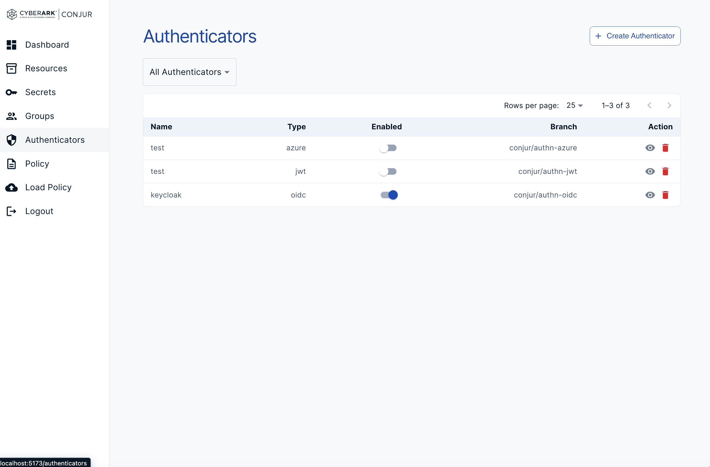

#### Authenticator Details
View authenticator configuration and manage its secret values and groups.

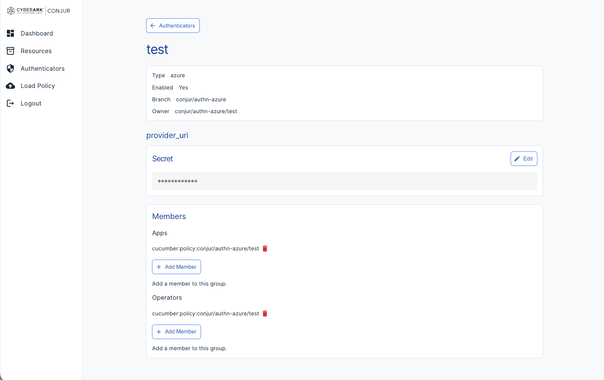

#### Create Authenticator - Multiple Types
Create authenticators across multiple supported authentication methods.

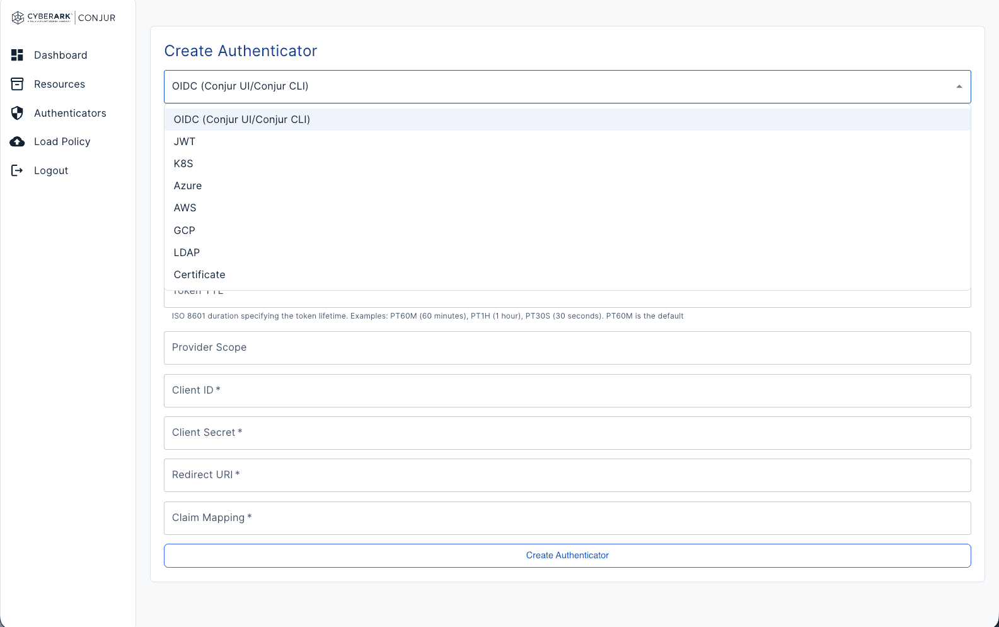

---

### Policy Management

#### Effective Policy
View the effective policy generated from loaded policy content.

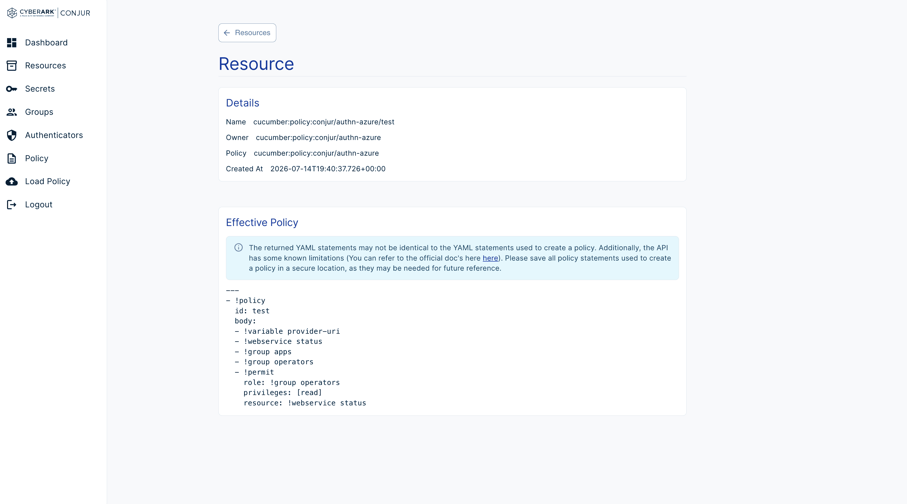

#### Policy Editor
Edit policies using the built-in YAML editor with validation feedback.

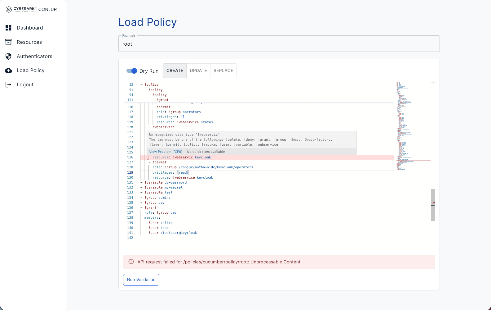

#### Policy Dry Run
Review resources that will be created, updated, or deleted before loading a policy.

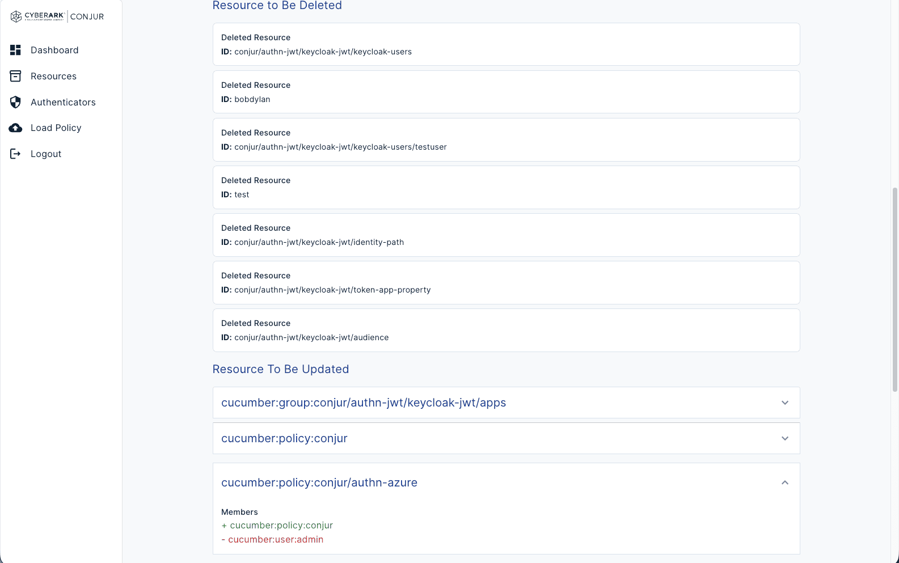